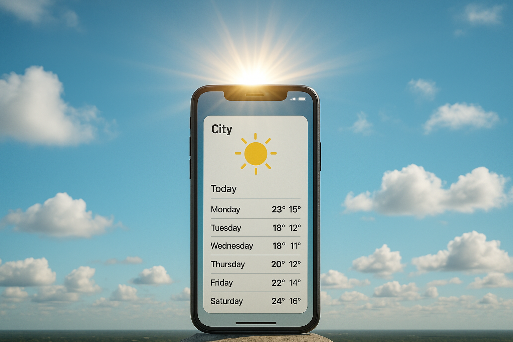

# 📱 Mini-Brief React Native : *"Ma météo de poche"*

## 🎯 Objectif :

Créer une application mobile React Native qui affiche la météo des **7 prochains jours** en se basant sur la localisation de l'utilisateur.

## 🧑‍💻 Contexte :

Vous êtes en stage dans une startup qui développe des applications utiles du quotidien. On vous demande de prototyper une app météo simple, fluide, qui affiche les prévisions météo à 7 jours autour de l'utilisateur.

## 🛠️ Contraintes techniques :

* 📦 Utiliser **React Native avec Expo**
* 📍 Utiliser l’API de localisation du téléphone (`expo-location`)
* 🌦️ Utiliser une API météo gratuite (OpenWeather, WeatherAPI, etc.)
* 🧪 Les données météo doivent être lisibles et présentées sous forme de liste ou de cartes
* 🎨 Libre choix du style (mais responsive et lisible)

## ✅ Fonctionnalités attendues :

* Autorisation d’accès à la **géolocalisation** (avec gestion du refus)
* Récupération des **coordonnées GPS**
* Appel à une **API météo** avec ces coordonnées
* Affichage :

  * de la **ville**
  * de la **date** de chaque jour
  * de la **température min/max**
  * d’une **icône météo** (nuage, soleil…)
* Bonus : design light/dark, animation météo (pluie qui tombe ?), pull to refresh…

## 🔧 Suggestions d’API météo :

* [OpenWeather OneCall](https://openweathermap.org/api/one-call-3) (nécessite une clé API)
* [WeatherAPI](https://www.weatherapi.com/)
* [Visual Crossing](https://www.visualcrossing.com/weather-api)

## 🚀 Astuces / docs utiles :

* 📍 `expo-location` : [https://docs.expo.dev/versions/latest/sdk/location/](https://docs.expo.dev/versions/latest/sdk/location/)
* 🌐 `fetch()` en React Native : [https://reactnative.dev/docs/network](https://reactnative.dev/docs/network)
* 🧪 Tester sur **Expo Go** avant de build
* 📅 Pour gérer les dates : `dayjs` ou `moment`

## 📦 Déploiement (facultatif) :

* Générer un APK pour Android avec `eas build`
* Tester sur un vrai téléphone via QR code

## 📝 Livrable attendu :

* Projet GitHub avec README expliquant l'installation
* App fonctionnelle testable sur un appareil (via QR ou APK)
